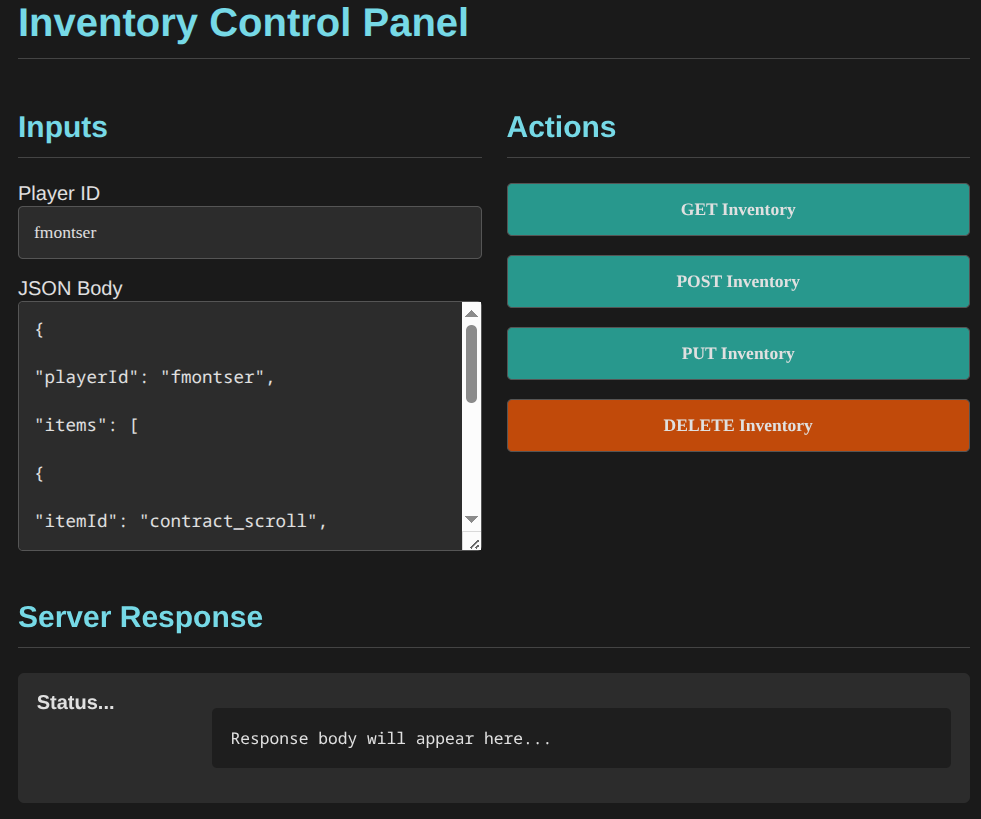

# UbInventory
Simple backend service to demonstrate a cached inventory management system

Technological stack:
 - Backend: Java (Spring Boot)
 - Database: MongoDB for persistent storage
 - Cache: Redis fast data access
 - Containerization: Docker (DB and cache)
 - Testing: Postman
 - Frontend: Simple demo with html/css/js

Dependecies:
 - Docker and docker-compose
 - Java 21 (Oracle), openJDK may or may not have problems.
 - Make

Instructions:

 - Check that you comply with the dependiencies
 - Default port is 8080, you can change it on
 ```
cached-inventory-service/src/main/resources/application.properties

server.port=8080
```

 - just run the make file on the project root directory
 ```bash
./UbInventory$> make
 ```
 - Open any internet browser a go to [http://localhost:8080](http://localhost:8080)

 - A simple interface will show up, you can now create, read, update and delete inventories.

 

